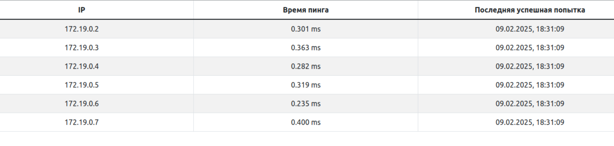

### Приложение для мониторинга докер-контейнеров

Данные выводятся в таблицу, доступную по адресу *http://localhost:3000*



Для запуска выполнить в корне проекта: ```docker-compose up -d --build```

По умолчанию список контейнеров обновляется раз 10 минут, а контейнеры пингуются раз в минуту (настраивается в конфиге).
Фронтенд запрашивает данные раз в 30 секунд.

Данные от *pinger* к *backend* передаются через брокер сообщений.

